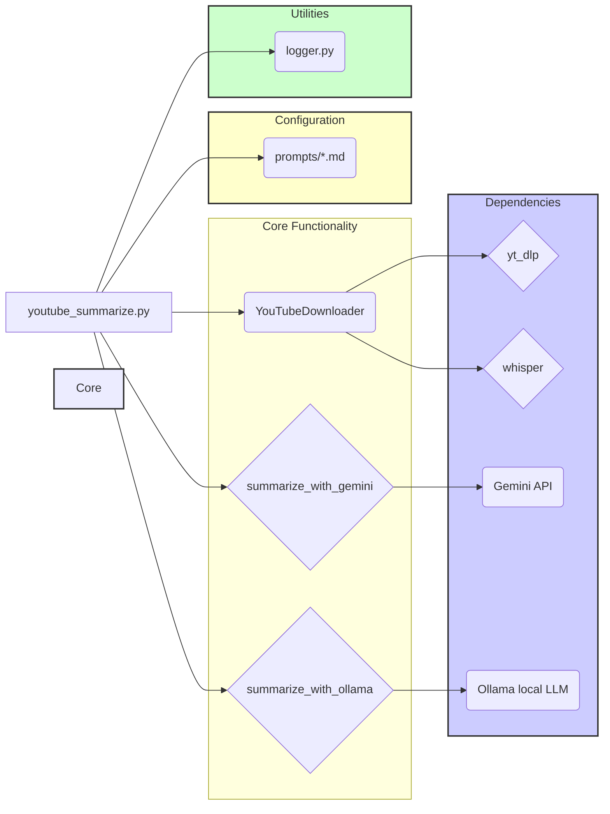

## Architecture Summary

**Description:**

The `youtube-summarize` project is a Python-based tool designed to download YouTube videos, extract their transcripts, and generate summaries using either the Gemini API or a local Ollama LLM. The project consists of several key components:

*   [`youtube_summarize.py`](youtube-summarize/youtube_summarize.py): This is the main script that orchestrates the entire process. It takes a YouTube video URL as input, downloads the video and its transcript, and then generates a summary using either the Gemini API or a local Ollama LLM, based on user preference. It uses `argparse` to handle command-line arguments, allowing users to specify the output directory, prompt file, metadata options, and the LLM to use.
*   [`download_video.py`](youtube-summarize/download_video.py): This module handles the downloading of YouTube videos and the extraction of transcripts. It uses the `yt_dlp` library to download the video and extract metadata. It first attempts to extract subtitles directly from YouTube. If subtitles are not available, it downloads the audio and transcribes it using the `whisper` library.
*   [`summarize.py`](youtube-summarize/summarize.py): This module contains the logic for generating summaries using either the Gemini API or a local Ollama LLM. It reads a prompt from a file and formats it with the transcript and metadata before sending it to the LLM. It uses the `google.generativeai` library to interact with the Gemini API and the `ollama` library to interact with a local Ollama LLM.
*   [`prompts/*.md`](youtube-summarize/prompts/prompt.md): These files contain prompts that are used to guide the LLM in generating summaries. The prompts are written in Markdown format and can be customized to generate different types of summaries.
*   [`logger.py`](youtube-summarize/logger.py): This module provides logging functionality for the project. It uses the `logging` module to log messages to the console.
*   [`run.sh`](youtube-summarize/run.sh) and [`setup.sh`](youtube-summarize/setup.sh): These are shell scripts that are used to set up and run the project. The `setup.sh` script installs the necessary dependencies using `brew` and `pip`. The `run.sh` script activates the virtual environment and runs the `youtube_summarize.py` script.

**Workflow:**

1.  The user runs the `youtube_summarize.py` script with a YouTube video URL as input.
2.  The `youtube_summarize.py` script uses the `YouTubeDownloader` class to download the video and extract the transcript and metadata.
3.  The `youtube_summarize.py` script uses either the `summarize_with_gemini` or `summarize_with_ollama` function to generate a summary.
4.  The summary is saved to a file in the output directory.